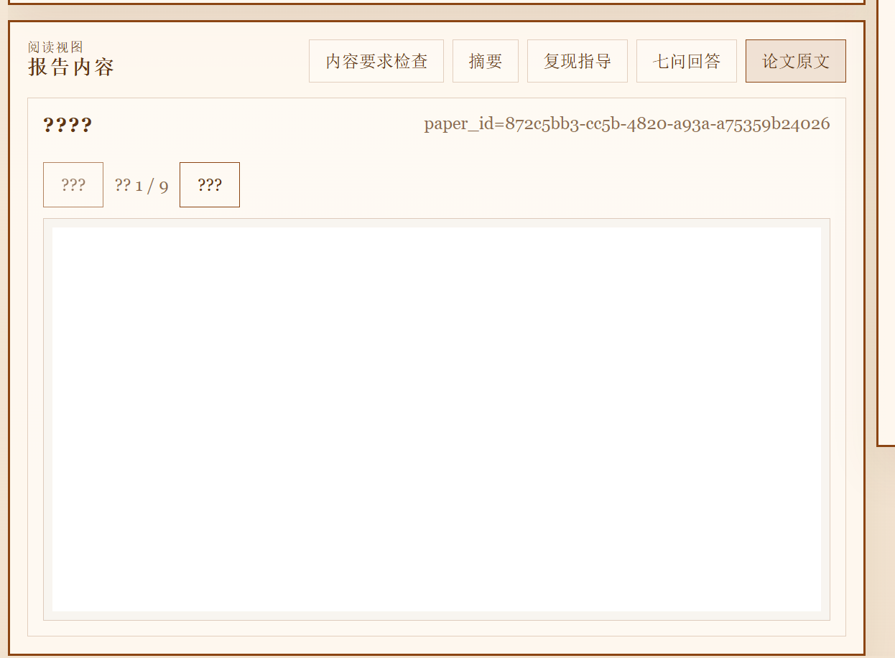

# AI Paper Coach

<p align="center">
  <strong>Read papers faster. Understand deeper. Reproduce with confidence.</strong>
</p>

<p align="center">
  
  
  
  
  
</p>

<p align="center">
  <a href="#english">English</a> | <a href="#zh-cn">简体中文</a>
</p>

---

<a id="english"></a>
## English

### Demo
<p align="center">
  
</p>

### What is AI Paper Coach?
AI Paper Coach is a student-first paper reading assistant.
Give it an arXiv/PDF URL or upload a PDF, and it generates structured outputs that are actually useful for study and implementation:

- 3-minute summary
- Explain-to-classmate version
- Reproduction guide
- Report quality checks
- Traceable pipeline logs

It is built for the "I need to understand this paper tonight" workflow.

### Why this project is worth trying
- **Fast onboarding**: start from URL/PDF to readable report in one flow.
- **Learning-oriented output**: not just summary text, but teaching-style explanation and actionable reproduction steps.
- **Pipeline transparency**: inspect analyze/review/finalize traces instead of black-box answers.
- **Pragmatic fallback**: if model keys are missing, MVP still runs with heuristic fallback.

### Core workflow
`ingest -> analyze -> review -> finalize -> report/export`

Default collaborative mode:
`Qwen draft -> MiniMax review -> Qwen patch`

### Project structure
```text
ai-paper-coach/
|- apps/web/          # Vue 3 + Vite frontend
|- services/api/      # FastAPI backend
|- docs/assets/       # README demo assets
|- PROJECT_PLAYBOOK.md
|- run.py             # start API + Web together
`- README.md
```

### Tech stack
- Frontend: Vue 3, Vue Router, Vite, pdfjs-dist
- Backend: FastAPI, Pydantic, Uvicorn, pypdf

### Quick start
#### 1) Backend dependencies
```bash
cd services/api
pip install -r requirements.txt
```

#### 2) Frontend dependencies
```bash
cd apps/web
npm install
```

#### 3) Environment
```bash
cp .env.example .env
```
Fill your model provider settings in `.env` (optional for MVP fallback mode).

#### 4) Run both services
```bash
python run.py
```

### Manual run (optional)
Backend:
```bash
cd services/api
uvicorn app.main:app --reload --host 0.0.0.0 --port 8000
```

Frontend:
```bash
cd apps/web
npm run dev -- --host 127.0.0.1 --port 5500
```

### API overview
- `POST /ingest`
- `POST /analyze`
- `POST /review`
- `POST /finalize`
- `GET /report/{paper_id}`
- `GET /export/{paper_id}.md`
- `GET /trace/{paper_id}`
- `POST /validate-models`

### Typical use cases
- Read a paper before class/seminar in under 10 minutes.
- Build a reproduction checklist for your own implementation.
- Compare pipeline trace quality across model settings.
- Keep local history/snapshots for iterative reading.

### Current status
MVP, actively evolving. Expect frequent iteration on parsing robustness, report depth, and UI polish.

### Roadmap (short)
- Better arXiv parsing reliability
- Stronger multi-paper comparison mode
- Richer evidence linking and citation UX
- Better long-PDF rendering/performance

### Contributing
Issues and PRs are welcome.
When contributing, please include:
- clear problem statement
- reproducible steps
- before/after behavior

---

<a id="zh-cn"></a>
## 简体中文

### Demo
<p align="center">
  
</p>

### AI Paper Coach 是什么？
AI Paper Coach 是一个面向学生和初学研究者的论文阅读助手。
你只需要输入论文链接（arXiv/PDF）或上传 PDF，就能得到结构化输出：

- 3 分钟速读摘要
- 讲给同学听版本
- 复现指导清单
- 报告质量检查
- 可追踪的流水线日志

它服务于一个非常实际的目标：**今晚就把论文看懂并能动手复现**。

### 这个项目值得看的原因
- **上手快**：从 URL/PDF 到可读报告一条链路跑通。
- **输出更“能用”**：不只给摘要，还给教学式解释和复现步骤。
- **过程可追踪**：可查看 analyze/review/finalize 的 trace，不是黑盒。
- **有兜底能力**：没配模型 key 时，MVP 也能走启发式流程。

### 核心流程
`ingest -> analyze -> review -> finalize -> report/export`

默认协作模式：
`Qwen 起草 -> MiniMax 评审 -> Qwen 修补`

### 目录结构
```text
ai-paper-coach/
|- apps/web/          # Vue 3 + Vite 前端
|- services/api/      # FastAPI 后端
|- docs/assets/       # README 演示图
|- PROJECT_PLAYBOOK.md
|- run.py             # 一键启动前后端
`- README.md
```

### 技术栈
- 前端：Vue 3、Vue Router、Vite、pdfjs-dist
- 后端：FastAPI、Pydantic、Uvicorn、pypdf

### 快速开始
#### 1）安装后端依赖
```bash
cd services/api
pip install -r requirements.txt
```

#### 2）安装前端依赖
```bash
cd apps/web
npm install
```

#### 3）配置环境变量
```bash
cp .env.example .env
```
在 `.env` 中填写模型配置（可选，不填会走 MVP 兜底逻辑）。

#### 4）一键启动
```bash
python run.py
```

### 手动启动（可选）
后端：
```bash
cd services/api
uvicorn app.main:app --reload --host 0.0.0.0 --port 8000
```

前端：
```bash
cd apps/web
npm run dev -- --host 127.0.0.1 --port 5500
```

### API 一览
- `POST /ingest`
- `POST /analyze`
- `POST /review`
- `POST /finalize`
- `GET /report/{paper_id}`
- `GET /export/{paper_id}.md`
- `GET /trace/{paper_id}`
- `POST /validate-models`

### 典型使用场景
- 课前/组会前，10 分钟内快速掌握论文。
- 生成可执行的复现 checklist。
- 对比不同模型配置下的流水线质量。
- 本地保存历史报告，迭代式阅读同一篇论文。

### 当前状态
项目处于 MVP 阶段，正在持续迭代。
重点会放在解析鲁棒性、报告深度和阅读体验上。

### 近期路线图
- 提升 arXiv 解析稳定性
- 增强多论文对比模式
- 加强证据引用与可追溯性
- 优化长 PDF 渲染与性能

### 贡献方式
欢迎提 Issue / PR。
建议在提交时提供：
- 问题描述
- 复现步骤
- 修改前后行为对比
