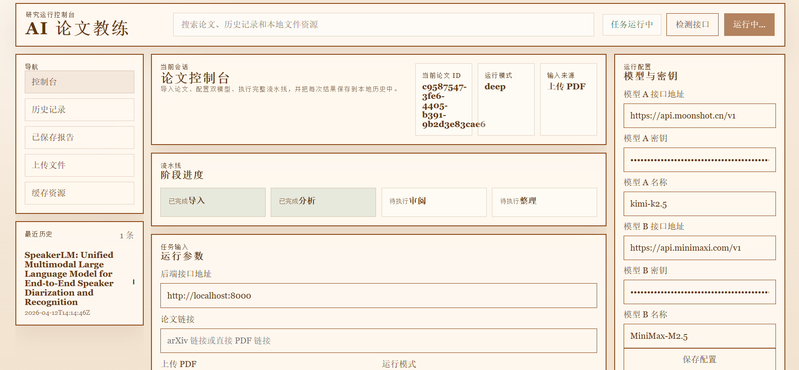
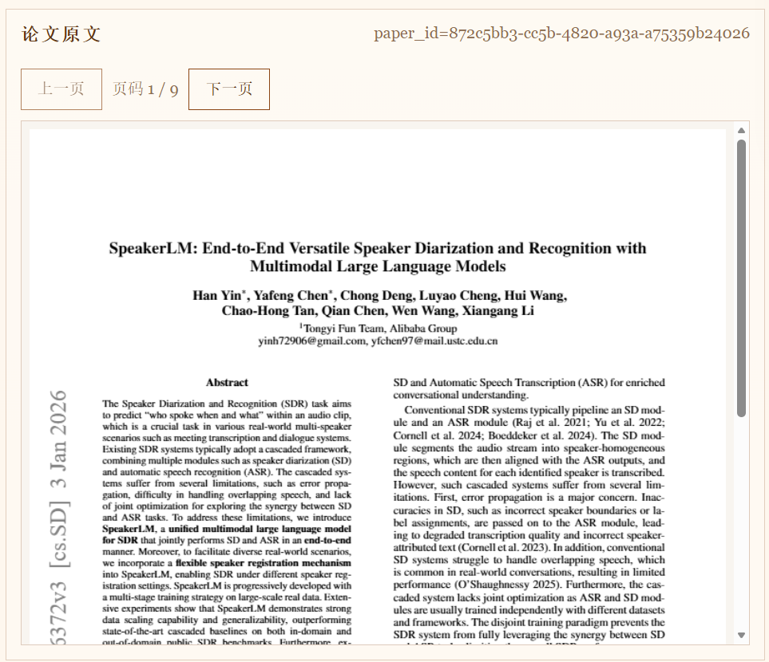
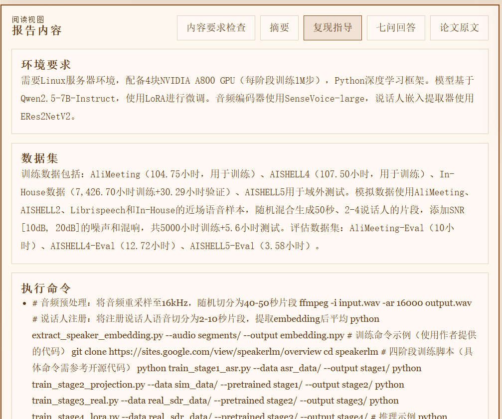
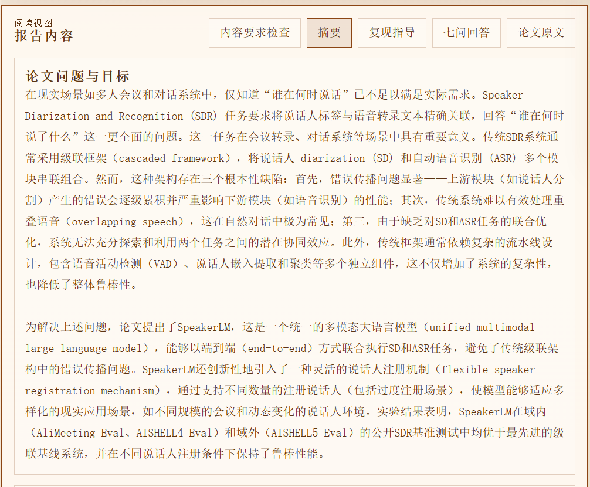

# AI Paper Coach

<p align="center">
  <strong>读论文更快，理解更深，复现更稳。</strong>
</p>

<p align="center">
  
  
  
  
  
</p>

<p align="center">
  <a href="#zh-cn">简体中文</a> | <a href="#english">English</a>
</p>

## GitHub About（建议配置）

> 可直接复制到仓库 About

**Description（中文）**  
面向学生和研究者的 AI 论文阅读与复现助手：结构化分析、复现指导、七问洞察、全流程可追踪。

**Description (English)**  
An AI paper coach for students and researchers: structured paper analysis, reproducibility guidance, 7-question insights, and traceable history.

**Suggested Topics**  
`ai` `paper-reading` `research-assistant` `llm` `fastapi` `vue3` `pdf` `reproducibility` `arxiv` `education`

**Repo Pitch**
- 一条流完成：`导入 -> 分析 -> 审阅 -> 整理 -> 报告`
- 双模型协作 + 七问框架 + 可回放 trace/API 诊断
- 适合课堂汇报、组会复述与复现实验落地

---

<a id="zh-cn"></a>
## 简体中文

### 项目简介
AI Paper Coach 是一个面向学生和研究者的论文阅读与复现助手。  
输入 arXiv/PDF 链接或直接上传 PDF，就能自动生成结构化报告，并支持后续问答与历史追踪。

### 30 秒价值说明
- 解决什么问题：把论文阅读中分散的「摘要理解、创新判断、复现落地」整合成一条可执行流程。
- 核心能力：结构化分析 + 七问框架 + 复现指导，并保留 trace 方便回溯诊断。
- 适用人群：课程汇报场景下的学生、做文献调研和实验复现的研究者。

### 为什么值得用
- 一条流完成：`导入 -> 分析 -> 审阅 -> 整理 -> 报告`
- 七问结构化输出：更适合课堂汇报、组会复述、复现实验
- 原文阅读联动：报告和 PDF 原文可对照查看
- 可追踪可回放：保留 trace、历史记录、已保存报告
- 支持删除管理：历史记录和已保存报告都可删除
- 新增 API 连通性验证：一键检查后端是否可达

### 最新界面截图
> 以下图片来自 `caogao/`

#### 整体界面


#### 论文原文阅读区


#### 摘要面板


#### 复现指导


#### 历史记录


### 核心功能
- 论文导入：URL / 本地 PDF
- 双模型协作：支持模型校验与配置保存
- 七问阅读框架：横向切换，间距紧凑
- 结果管理：历史记录、已保存报告、删除功能
- 导出能力：Markdown 报告导出
- 诊断信息：运行日志 + trace 记录

### 内容要求阈值（当前）
- 摘要（论文问题与目标）：`>= 800` 字
- 复现指导（整体）：`>= 1000` 字
- 七问长答：每题 `>= 700` 字

### 常见问题（FAQ）
**Q1：模型 key 放哪里？**  
A：放在项目根目录 `.env`，并按 `.env.example` 填写。生产环境建议用系统环境变量注入，不直接写入仓库文件。

**Q2：为什么 finalize 阶段有时比较慢？**  
A：`finalize` 会进行结构整理、长度校验、必要时触发 repair 和重试。现在已经在 trace 中增加模型调用耗时、repair 触发标记和重试次数，便于定位慢点。

**Q3：为什么标题显示“论文中未明确说明”？**  
A：当 PDF/元数据解析失败或命中占位文本时会回退到该占位。当前版本已补 arXiv API 标题补全和占位识别逻辑，建议对同一论文重新执行完整流程。

**Q4：复现指导为空怎么处理？**  
A：当前版本已增加兜底合并逻辑。若仍为空，按「`ingest -> analyze -> review -> finalize`」重新跑一次，trace 会显示是否触发 repair 与重试。

### 版本与路线图
- `v0.1`（已完成）
- 完整主流程：`ingest -> analyze -> review -> finalize -> report`
- 七问结构化输出与阈值校验
- 历史记录/保存报告管理（含删除）
- finalize 可观测性（耗时、repair、重试）与 trace 回放
- 标题提取增强（含 arXiv API 兜底）和复现指导空内容修复

- `v0.2`（计划中）
- 阶段级性能优化（降低 finalize 尾段时延）
- 失败可恢复执行（按阶段断点续跑）
- 更细粒度质量评分和告警
- 更完整的前端运行态可观测面板

Release Note：见 `docs/releases/v0.1.0.md`

### 安全声明
- API Key 不会提交到仓库：`.env`、`.env.*`、`*.env.local` 已在 `.gitignore` 中忽略。
- 支持 `gitleaks` 历史扫描；当前仓库历史扫描结果为 `0` 命中（无疑似密钥泄露）。
- 可选开启后端鉴权：`APC_REQUIRE_API_KEY=1` + `APC_API_KEY`，请求头使用 `x-api-key`。

### 项目结构
```text
ai-paper-coach/
|- apps/web/          # Vue 3 + Vite 前端
|- services/api/      # FastAPI 后端
|- data/              # 本地数据（报告/历史/缓存）
|- caogao/            # README 截图素材
|- docs/
|- run.py             # 一键启动前后端
`- README.md
```

### 快速开始
#### 1) 安装后端依赖
```bash
cd services/api
pip install -r requirements.txt
```

#### 2) 安装前端依赖
```bash
cd apps/web
npm install
```

#### 3) 配置环境变量
```bash
cp .env.example .env
```
按需填写模型配置；不填也可在 MVP 模式下运行部分流程。

安全相关可选配置：
- `APC_ALLOWED_ORIGINS`：CORS 白名单，逗号分隔（如 `http://localhost:5500,https://your-domain.com`）
- `APC_MAX_UPLOAD_MB`：上传 PDF 大小限制（默认 `20`）
- `APC_REQUIRE_API_KEY`：是否开启 API Key 鉴权（`0/1`）
- `APC_API_KEY`：鉴权 key（请求头使用 `x-api-key`）

#### 4) 一键启动
```bash
python run.py
```

#### 5) 运行后端测试（新增）
```bash
cd services/api
pytest -q
```

### 手动启动（可选）
后端：
```bash
cd services/api
uvicorn app.main:app --reload --host 0.0.0.0 --port 8000
```

前端：
```bash
cd apps/web
npm run dev -- --host 127.0.0.1 --port 5500
```

### 主要 API
- `GET /health`（API 连通性检查）
- `POST /validate-models`（模型接口校验）
- `POST /ingest`
- `POST /analyze`
- `POST /review`
- `POST /finalize`
- `GET /report/{paper_id}`
- `GET /export/{paper_id}.md`
- `GET /trace/{paper_id}`
- `GET /history` / `DELETE /history/{record_id}`
- `GET /saved` / `DELETE /saved/{record_id}`


### 统一响应结构
除流式接口外，JSON 接口统一返回：

```json
{
  "success": true,
  "data": {},
  "error": null
}
```

失败返回：

```json
{
  "success": false,
  "data": null,
  "error": {
    "code": 400,
    "message": "...",
    "details": null
  }
}
```


### 适用场景
- 上课/组会前 10 分钟快速吃透论文
- 形成复现实验 TODO 清单
- 比较不同模型配置下的输出质量
- 长期积累论文阅读档案

---

<a id="english"></a>
## English

### Overview
AI Paper Coach helps students and researchers read papers faster and reproduce results with more confidence.
You can ingest a paper from URL/PDF, generate structured reports, and continue with Q&A and traceable history.

### 30-Second Value
- Problem solved: unify scattered paper reading tasks (understanding, critique, reproducibility) into one workflow.
- Core capability: structured analysis + 7-question framework + reproducibility guidance with traceable diagnostics.
- Audience: students preparing talks and researchers doing literature review or reproduction work.

### Highlights
- End-to-end pipeline: `ingest -> analyze -> review -> finalize -> report`
- Structured 7-question reading framework
- Side-by-side report + original PDF reading
- History and saved reports with deletion support
- One-click API connectivity check (`/health`)

### Content Thresholds (Current)
- Summary (`three_minute_summary.problem`): `>= 800` chars
- Reproduction guide (combined fields): `>= 1000` chars
- 7 Q&A answers: each `>= 700` chars

### FAQ
**Where should I put model keys?**  
Use the project root `.env` (based on `.env.example`). For production, prefer environment-variable injection.

**Why can `finalize` be slow?**  
`finalize` may trigger repair/retry loops after validation. Trace now records per-call latency, repair trigger, and retry count.

**Why does title show a placeholder?**  
When parsing metadata/title fails, a placeholder is used. Current version adds arXiv API fallback and better placeholder detection.

**What if reproduction guidance is empty?**  
Current version includes fallback merge logic. Re-run `ingest -> analyze -> review -> finalize` and inspect trace if needed.

### Version & Roadmap
- `v0.1` done: full pipeline, 7-question outputs, trace observability, title fallback improvements, reproduction-guide empty-content fix.
- `v0.2` planned: lower finalize latency, resumable stage runs, finer quality signals, richer runtime observability UI.

### Security Statement
- API keys are not committed: `.env`, `.env.*`, and `*.env.local` are ignored.
- `gitleaks` history scan is supported; current repository scan reports `0` findings.
- Optional backend key auth: `APC_REQUIRE_API_KEY=1` and `APC_API_KEY` via `x-api-key` header.

### Quick Start
```bash
# backend
cd services/api
pip install -r requirements.txt

# frontend
cd apps/web
npm install

# run all
python run.py

# backend tests
cd services/api
pytest -q
```

Optional security env vars in `.env`:
- `APC_ALLOWED_ORIGINS`: comma-separated CORS whitelist
- `APC_MAX_UPLOAD_MB`: upload limit in MB (default `20`)
- `APC_REQUIRE_API_KEY`: enable API key auth (`0/1`)
- `APC_API_KEY`: expected value in `x-api-key` header

### Key APIs
- `GET /health`
- `POST /validate-models`
- `POST /ingest`
- `POST /analyze`
- `POST /review`
- `POST /finalize`
- `GET /report/{paper_id}`
- `GET /export/{paper_id}.md`
- `GET /trace/{paper_id}`


### Unified Response Envelope
For non-streaming JSON APIs, the response format is:

```json
{
  "success": true,
  "data": {},
  "error": null
}
```

Error format:

```json
{
  "success": false,
  "data": null,
  "error": {
    "code": 400,
    "message": "...",
    "details": null
  }
}
```


---

### Contributing
Issues and PRs are welcome.
Please include:
- clear problem statement
- reproducible steps
- expected vs. actual behavior

